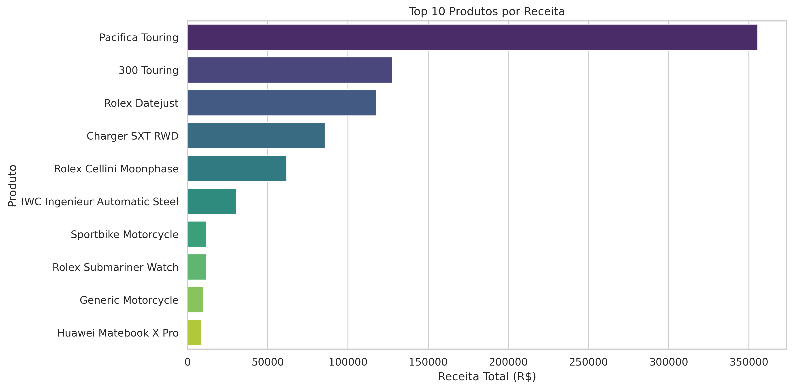
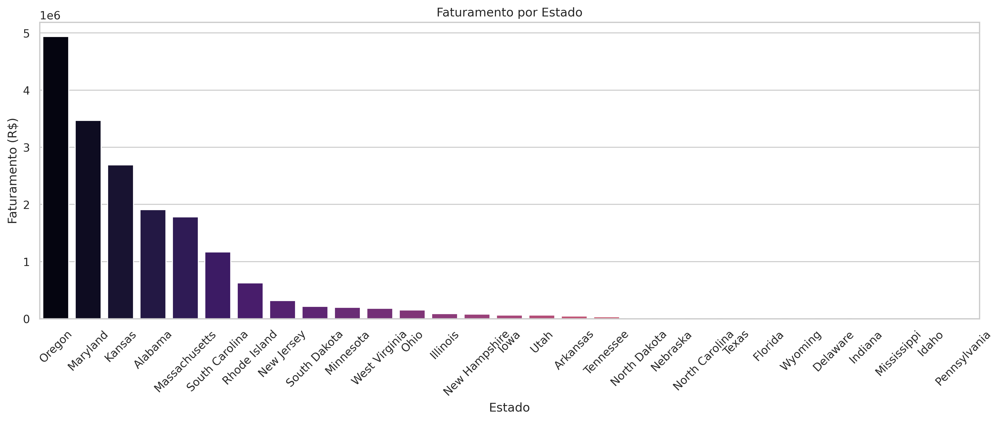
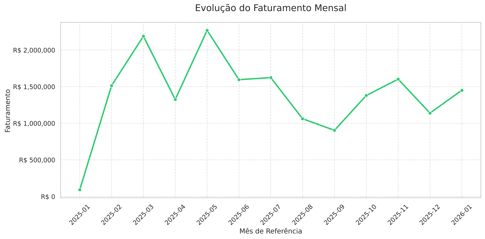
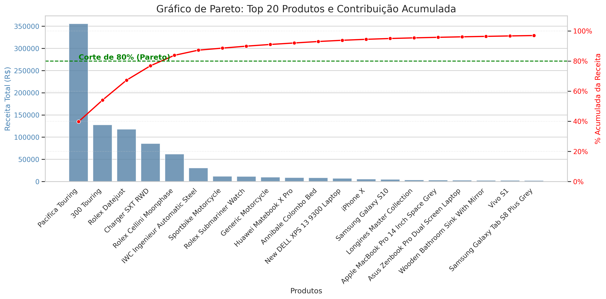

<div style="display: inline_block">
  
  
  
  
  
  
  
</div>

<br/>

---

## 📁 Estrutura do Projeto

```text
.
├── src/
│   ├── database.py    # Definição de DDL e Schema (SQLAlchemy)
│   ├── extract.py     # Leitura de coleções MongoDB
│   ├── transform.py   # Regras de negócio e transformação Star Schema
│   ├── load.py        # Lógica de Upsert e carga SQL
│   ├── config.py      # Configurações de tabelas e mapeamentos
│   └── utils.py       # Funções auxiliares e conversores
├── img/               # Ativos visuais e gráficos das análises
├── main.py            # Orquestrador central do ETL
├── queries.sql        # Consultas analíticas otimizadas
├── docker-compose.yml # Infraestrutura como código
└── requirements.txt   # Dependências do projeto
```

---

## 🏗️ Arquitetura e Tecnologias

O projeto foi estruturado para garantir escalabilidade e facilidade de manutenção:
* **Linguagem:** Python 3.10
* **Processamento de Dados:** Pandas (utilizado para transformação e normalização)
* **Comunicação DB:** SQLAlchemy & Psycopg2
* **Containerização:** Docker & Docker Compose

---

## 📊 Modelagem de Dados (Star Schema)

* **Tabelas de Fato:**
    * `fact_sales`: Consolidação de cabeçalhos de pedidos, totais e datas.
    * `fact_sales_items`: Granularidade ao nível de item/SKU para análises de mix de produtos.
* **Tabelas de Dimensão:**
    * `dim_users`: Atributos demográficos e geográficos dos clientes.
    * `dim_products`: Informações detalhadas sobre o catálogo de produtos.
    * `dim_date`: Dimensão de tempo gerada para facilitar filtros temporais (ano, mês, dia da semana).

---

## 🛠️ Decisões de Engenharia e Boas Práticas

### 1. Idempotência (Upsert Logic)
O pipeline utiliza uma estratégia de **Upsert** baseada em tabelas temporárias. Antes da carga final, os dados são inseridos em uma `temp_table` e movidos para a tabela definitiva utilizando `ON CONFLICT (pk) DO UPDATE`. Isso garante que o estado do banco permaneça consistente sem duplicatas.

### 2. Tratamento de Dados e Resiliência
* **Datas Híbridas:** Implementação da função `converter_data_hibrida` que lida automaticamente com formatos variados (Unix Timestamp e strings ISO).
* **Schema Enforcement:** Uso de mapeamento (`TABLE_SCHEMAS`) para garantir que o DataFrame possua exatamente as colunas e tipos esperados pelo PostgreSQL.
* **Limpeza de Tipos Complexos:** Conversão automática de dicionários e listas aninhadas do JSON original para SQL.

### 3. Observabilidade
O pipeline utiliza o módulo `logging` do Python:
* **INFO:** Registra início/fim de etapas e volumetria.
* **WARNING:** Alerta sobre inconsistências menores tratadas.
* **ERROR:** Reporta falhas críticas de conexão ou esquema.

---

## 🚀 Como Executar

**Pré-requisitos:** Docker e Docker Compose instalados.

1. **Clone o repositório:**
   ```bash
   git clone [https://github.com/seu-usuario/data_engineer_test.git](https://github.com/seu-usuario/data_engineer_test.git)
   cd data_engineer_test
   ```

2. **Inicie o ambiente:**
   ```bash
   docker compose up -d --build
   ```

3. **Acompanhe o processamento:**
   ```bash
   docker logs -f etl_job
   ```

---

## 🔍 Análises e Insights

### 1. Performance por Categoria e Estado
Distribuição da receita entre as categorias de produtos e visão consolidada por região.

| Faturamento por Categoria | Faturamento por Estado |
|---|---|
|  |  |

### 2. Evolução Mensal
Acompanhamento temporal para identificação de sazonalidades.


### 3. Curva de Pareto (Regra 80/20)
Identificação do grupo de produtos que representa a maior parte do faturamento.


---

## 🗄️ Exemplo de Consulta Analítica (Pareto)

```sql
WITH product_sales AS (
    SELECT 
        p.title,
        SUM(i.discountedtotal) as receita_total
    FROM fact_sales_items i
    JOIN dim_products p ON i.product_id = p.product_id
    GROUP BY p.title
),
pareto_calc AS (
    SELECT 
        title,
        receita_total,
        SUM(receita_total) OVER (ORDER BY receita_total DESC) as receita_acumulada,
        SUM(receita_total) OVER () as receita_global
    FROM product_sales
)
SELECT 
    title,
    receita_total,
    ROUND((receita_acumulada / receita_global) * 100, 2) as porcentagem_acumulada
FROM pareto_calc
ORDER BY receita_total DESC
LIMIT 20;
```
